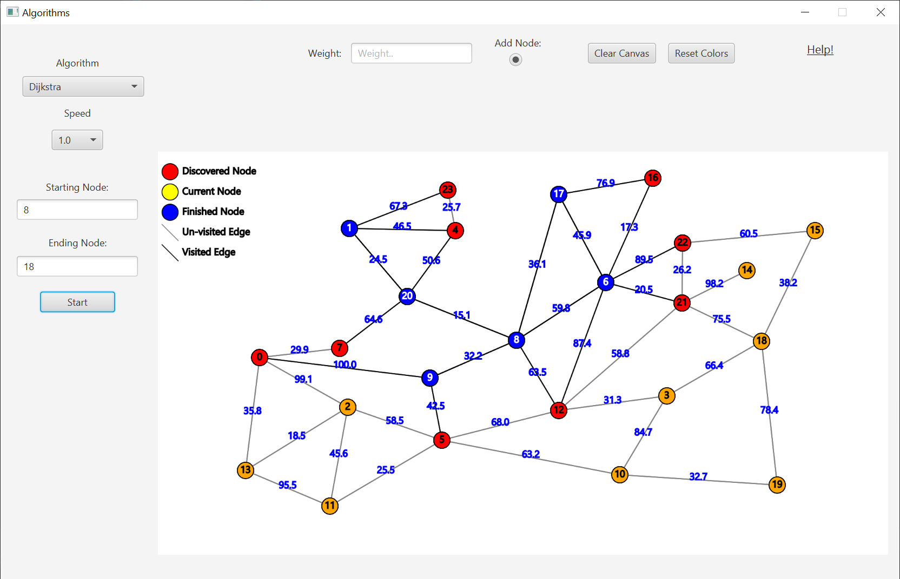

# Little Algorithm Project
This projects main idea is to visualize pathfinding algorithms on graphs.  
The main algorithms for this project are:
* Dijkstra's algorithm.
* BFS algorithm.
* DFS algorithm.

# Contributors:
* Alex Baranov.  
