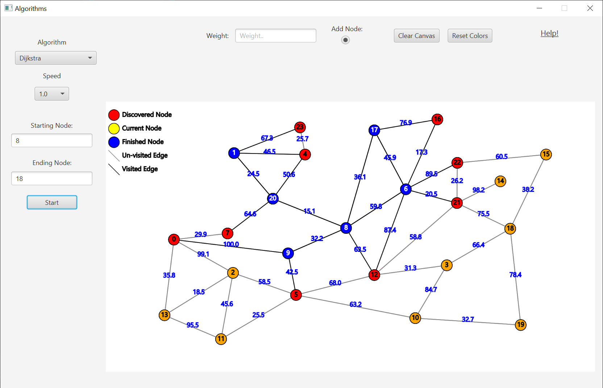
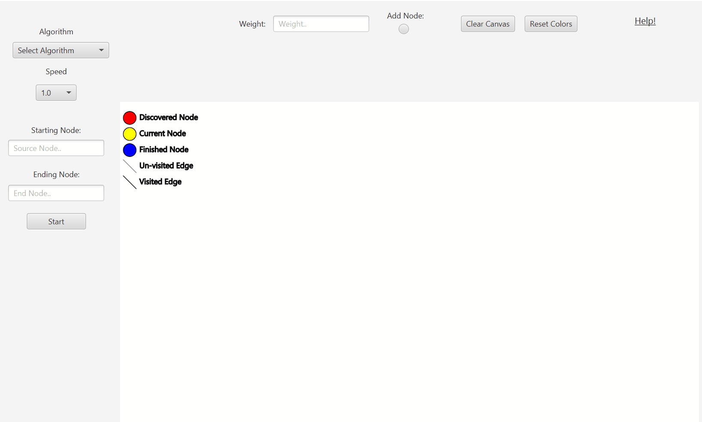
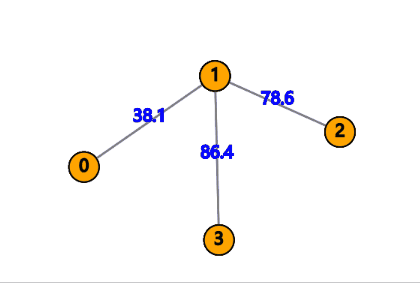
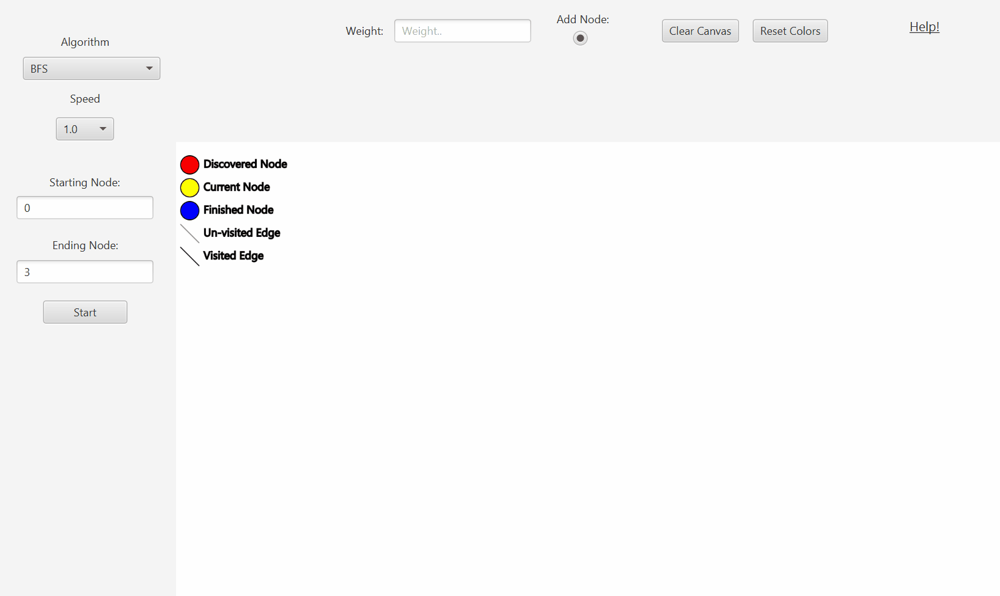

# Algorithms Visualizer Program

This projects main idea is to visualize pathfinding algorithms on graphs.  
The main algorithms for this project are:
* Dijkstra's algorithm.
* BFS algorithm.
* DFS algorithm.

Basic utilization of the programs:

This programs includes a drag and drop function:

Adding desired weight:

# Contributors:
* Alex Baranov.  
